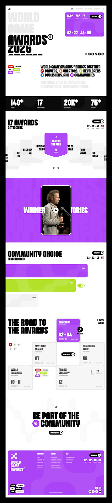
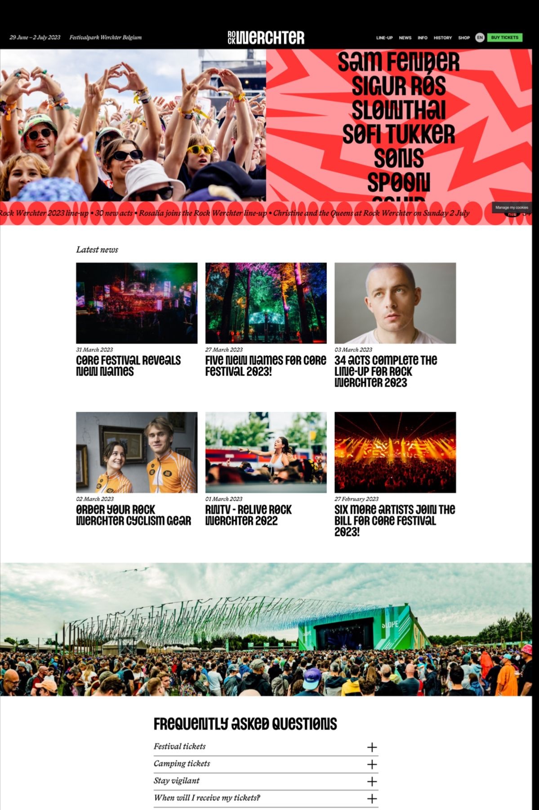

design reference ()

1️⃣ Landing Page (Generate First)
Design a premium landing page for Eventrix, a modern event discovery and ticket booking platform.

The design should feel like a blend of Framer, Awwwards, Stripe, Linear, Airbnb and Spotify while maintaining excellent usability.

Visual direction:
• Bold editorial typography
• Large immersive hero
• Premium event photography
• Festival-inspired branding
• Vibrant gradients
• Glassmorphism
• Floating stickers
• Asymmetrical layouts
• Soft shadows
• Premium cards
• Smooth modern spacing
• Rounded corners

Sections:
- Sticky Navbar
- Hero
- Search Events
- Featured Events
- Popular Categories
- Trending Events
- Upcoming Events
- Why Eventrix
- Stats
- Testimonials
- Newsletter
- Footer

Hero should include:
- Huge headline
- Search bar
- CTA buttons
- Featured Event Card
- Floating decorative elements
- Dynamic gradient background

Dark mode first.

No generic SaaS layout.

Create something visually memorable.

2️⃣ Events Page
Design a premium Event Discovery page.

Include:

Sticky filters

Search

Categories

Date picker

Location filter

Price filter

Grid/List toggle

Beautiful Event Cards

Each card should have:

Large image

Glass overlay

Category badge

Date

Venue

Price

Available seats

Organizer

Bookmark

Hover animation

Book Ticket CTA

The page should feel modern, premium and editorial.
3️⃣ Event Details Page
Design a premium Event Details page.

Include:

Large hero image

Sticky booking card

Countdown timer

Event information

Schedule timeline

Speakers

Venue map

Gallery

Reviews

Related events

FAQ

Beautiful ticket booking panel.

Inspired by premium event platforms.

Focus on storytelling.
4️⃣ Booking Flow
Design a multi-step booking experience.

Steps:

Select Ticket

Seat Selection

Order Summary

Payment

OTP Verification

Booking Success

QR Ticket

Premium checkout experience.

Minimal.

Modern.

Exciting.
5️⃣ Authentication
Design Login, Register, Forgot Password and OTP Verification.

Split screen layout.

Beautiful illustrations.

Festival branding.

Animated background.

Minimal forms.

Dark mode.

Premium SaaS quality.
6️⃣ User Dashboard
Design a modern user dashboard.

Sidebar

Upcoming Events

Past Bookings

Wishlist

Notifications

Invoices

QR Tickets

Profile

Statistics Cards

Calendar

Minimal premium dashboard inspired by Linear.
7️⃣ Admin Dashboard
Design a premium admin dashboard.

Revenue Analytics

Bookings

Events

Users

Charts

Tables

Calendar

Activity Feed

Quick Actions

Modern clean design inspired by Stripe Dashboard and Vercel.

8️⃣ Mobile Design
Design responsive mobile layouts for all Eventrix screens.

Bottom navigation

Gesture friendly

Large touch targets

Modern cards

Compact dashboard

Premium animations.